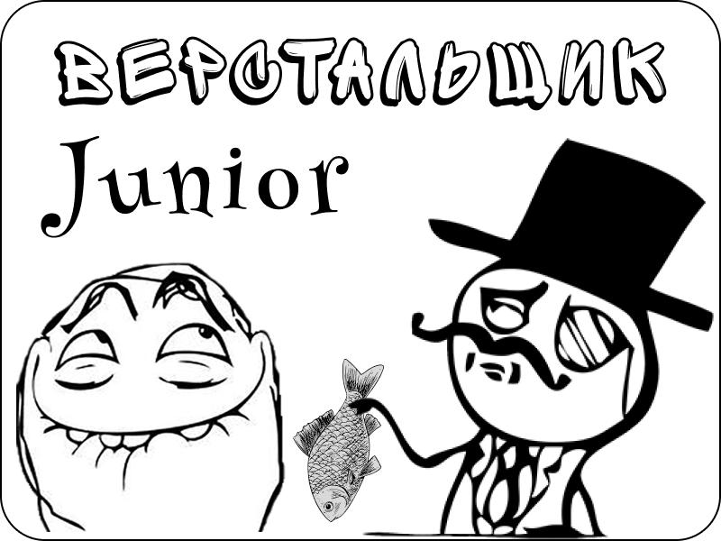

 Frontend project. Учебный проект. Сайт написан в рамках обучения по направлению Frontend-разработка и представляет из себя каталог простых, казуальных игр, так же, целенаправленно, написанных без использования бэкенда. 

#### Развёрнутый проект можно посмотреть тут:
- [GitHub Pages](https://rommcl.github.io/CasualGamesRomMcl/)

#### При развёртывании локально:
**Важно!** В JavaScript используется модульная система, поэтому при локальном запуске необходимо использовать локальный веб-сервер, например, OpenServer или использовать возможности «живого сервера» редактора, например, расширение Live Server для VS Code.

#### Содержание:
1. **Сайт**
    - [Главная страница](#page-main)
    - [Каталог игр](#page-catalog)
    - [Погода за окном (API)](#page-weather)
    - [Обратная связь](#page-feedback)
2. **Игры**
    - [Верстальщик](#game-layoutDesigner)

---

## Описание сайта
Сайт (за исключением игр) разработан с использованием библиотек Bootstrap 5 и jQuery-3.7.1 (раздел с погодой).
Адаптация под различные экраны реализована средствами библиотеки Bootstrap.

### Главная страница
Помимо описания сайта, на главной странице живёт жук Стасик. Три режима Стасика: мирная жизнь, опасность и охота. В мирной жизни Стасик рандомно путешествует по зоне своего обитания, напевая песенку. В режиме опасности (наведение курсора на его территорию) жук ускоряется и замирает. При стрельбе мимо - жук не реагирует. Если покинуть его зону, он продолжит свой мирный цикл. При попытке попасть по нему, Стасик входит в режим охоты, отпрыгивает и разворачивается в сторону нанесенного удара. После окончания охоты жук возвращается в начальный угол и начинает мирный цикл заново.

### Каталог игр
Очень надеюсь, что времени на пополнение каталога будет хвать, поэтому следите за обновлениями. :)

### Погода за окном
Для получения текущей погоды используется открытый API на ресурсе по адресу openweathermap.org.  Данный ресурс ввёл против РФ санкции (стыд им и позор от всего комьюнити), в результате которых нормальное обращение к API с наших IP не представляется возможным, поэтому пришлось применить «параллельный импорт» (подробности в коде). Таким образом всё работает ***без применения vpn***.

### Обратная связь
Для осуществления обратной связи используется сервис ***mailJS***. Предусмотрена простейшая система валидации заполнения формы.

---

## Описание игр

## Игра - Верстальщик

**Жанр:** Найди пару, Викторина

В игре главному герою предстоит находить пары тегов (открывающий и закрывающий) и правильно отвечать на вопросы Сеньора, чтобы не получить Лещей и не быть отстранённым от проекта. Так же не стоит забывать о дедлайне! Предусмотрена настройка сложности. В режиме Код-ревью Сеньор будет проверять не только сами теги на их соответствие, но и следить за порядком их открывания. А в режиме Злого Сеньора, за неправильные ответы, Джуниор будет получать Лещей, что может привести к фатальным результатам.

**Техническая информация:**
Игра реализована без сторонних зависимостей (библиотек, фреймворков). Ручная вёрстка (Grid, Flex), адаптация под разные размеры экранов. Ванильный JavaScript, модульная система.

[Вверх](#top-page)